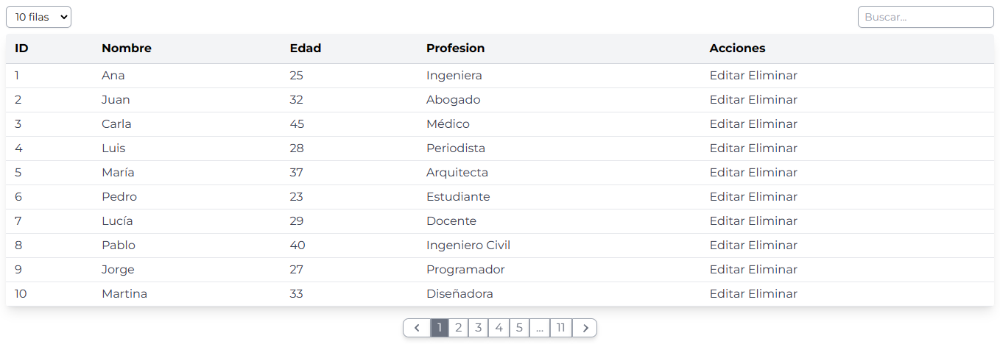

# CRONOS DATATABLE

```
npm install
npm run dev
```

## Descripción

- realizado con tailwindcss y javascript
- datatable responsive

## Imagenes



## USO

### HTML

```html
<link href="./assets/cronos.datatable.css" rel="stylesheet" />
<body>
	<div id="table-container" class="p-3"></div>

	<script src="./assets/cronos.datatable.js"></script>
</body>
```

### Javascript

```javascript
const headers = {
	id: "ID",
	name: "Nombre",
	age: "Edad",
	profession: "Profesion",
	action: "Acciones",
};

async function renderizar() {
	const link = "users.json";
	const response = await fetch(link);
	const data = await response.json();
	//agregar action data de botones de editar y eliminar
	data.forEach((element) => {
		element.action = `<button class="btn-editar" data-id="(${element.id})">Editar</button> <button class="btn-eliminar" data-id="(${element.id})">Eliminar</button>`;
	});

	const table = new DataTable("#table-container", data, headers, [10, 15, 20]);
	table.init();
}
renderizar();
```
